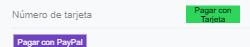
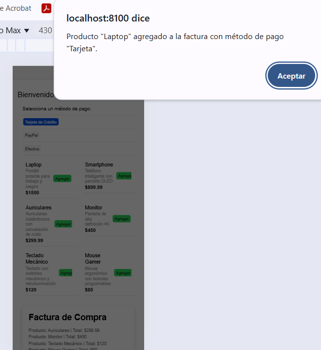
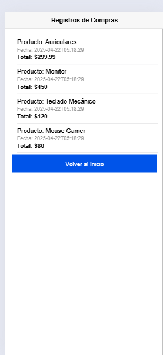

# 📌 HU04: Interfaz de Usuario para la Gestión de Compras

## 📝 **Título:** Diseño y Funcionamiento del Frontend

### **Descripción**
Como **usuario**, quiero **una interfaz visual intuitiva** que me permita **navegar, seleccionar productos y completar compras fácilmente**, asegurando que el método de pago se registre correctamente en la factura.

### ✅ **Criterios de Aceptación**
-  La aplicación debe mostrar una lista de productos disponibles con precio y descripción.
-  Cada producto debe tener un botón "Agregar" que registre la compra en la factura.
-  El usuario debe poder elegir un método de pago antes de finalizar la compra.
-  El sistema debe almacenar y visualizar todas las compras realizadas en una página dedicada.
-  La interfaz debe ser responsiva y adaptarse a dispositivos móviles y escritorio.

---

## 🏗️ **Flujo de Trabajo**
### **1️⃣ Página Principal - Home**
🔹 Muestra la bienvenida y los productos disponibles.  
🔹 El usuario puede agregar productos a la factura.  
🔹 Se presenta un botón para ver las compras realizadas.  

---

### **2️⃣ Selección de Método de Pago**
🔹 El usuario debe seleccionar un método de pago antes de agregar productos.  
🔹 Métodos disponibles: **Tarjeta, PayPal, Efectivo**.  
🔹 La opción elegida se debe reflejar en la compra.  

---

### **3️⃣ Agregar Productos a la Factura**
🔹 Cada producto tiene un botón "Agregar".  
🔹 Al presionar "Agregar", el producto se registra junto con el método de pago.  
🔹 Se muestra una confirmación visual de la compra.  

---

### **4️⃣ Página de Compras**
🔹 Muestra todas las compras registradas.  
🔹 Cada compra debe reflejar el producto, precio, fecha y método de pago.  
🔹 El usuario puede ver el historial de compras desde el botón en Home.  

---

## 🔧 **Requisitos Técnicos**
- ✅ **Ionic React** como framework de frontend.
- ✅ **Componentes principales:** `Home.tsx`, `ProductList.tsx`, `PaymentMethods.tsx`, `Compras.tsx`.
- ✅ **API REST** integrada con el backend para la gestión de productos y compras.
- ✅ **Estado global** en React para manejar el método de pago seleccionado.
- ✅ **Navegación controlada con React Router** (`routerLink` entre páginas).

---

## 🚀 **Resultado Esperado**
- La interfaz debe ser clara y eficiente, permitiendo compras rápidas.  
- Los métodos de pago deben reflejarse correctamente en cada compra.  
- El historial de compras debe estar disponible para consulta en todo momento.  

---

### 📌 **Notas**
📌 *Si necesitas agregar más detalles técnicos o componentes específicos, dime y los ajustamos.*  
📌 *Puedes insertar imágenes en los espacios marcados con `` cuando las tengas listas.*  
