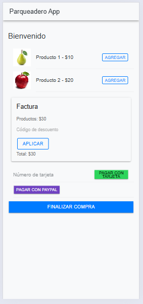

# HU1 - Lista de Productos  

## 📌 Descripción  
Como usuario, quiero visualizar una lista de productos con sus precios y descripciones, para elegir qué comprar.  

## 🎯 Objetivo  
Proporcionar una interfaz intuitiva para seleccionar productos.  

## ✅ Criterios de aceptación  
- La lista debe mostrar nombre, precio y categoría de cada producto.  
- Cada producto debe tener una imagen.  
- Debe permitir agregar productos al carrito.  

##  CODIGO  
  

##  RESULTADO  
  

##  Desarrollo  
- Crear el componente `ProductList.tsx`.  
- Integrar imágenes y botones de acción.  

