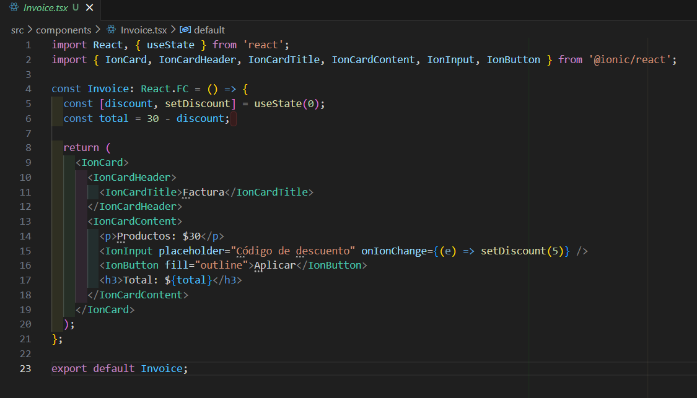

# HU2 - Factura  

## 📌 Descripción  
Como usuario, quiero visualizar el resumen de mi compra, con el total y los productos adquiridos, para confirmar mi pago.  

## 🎯 Objetivo  
Brindar transparencia en los costos y permitir aplicar descuentos.  

## ✅ Criterios de aceptación  
- Debe mostrar los productos comprados.  
- Debe calcular el total automáticamente.  
- Debe permitir aplicar cupones de descuento.  

##  CODIGO  
  

##  RESULTADO  
  

##  Desarrollo  
- Implementar un componente `Invoice.tsx` con cálculos dinámicos.  
- Agregar una funcionalidad de cupones.  
