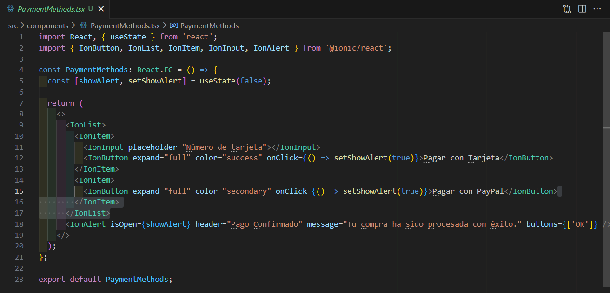

# HU3 - Métodos de Pago  

## 📌 Descripción  
Como usuario, quiero seleccionar un método de pago seguro, para completar mi compra con confianza.  

## 🎯 Objetivo  
Permitir el pago de manera rápida y confiable.  

## ✅ Criterios de aceptación  
- Debe permitir elegir tarjeta o PayPal.  
- Debe mostrar un mensaje de confirmación tras la selección.  
- Debe solicitar información de pago antes de procesar.  

##  CODIGO  
  

##  RESULTADO  
  

##  Desarrollo  
- Implementar el componente `PaymentMethods.tsx`.  
- Integrar mensajes de confirmación.  

