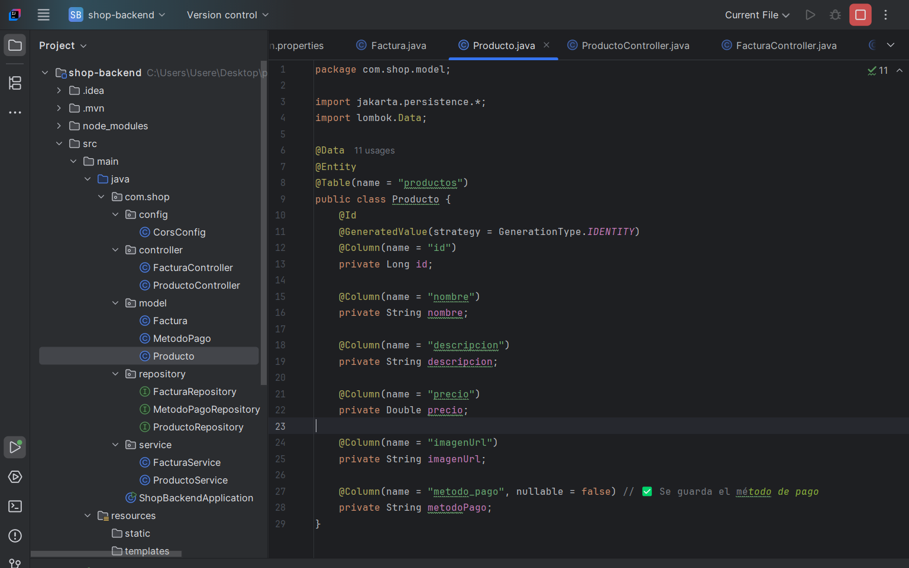
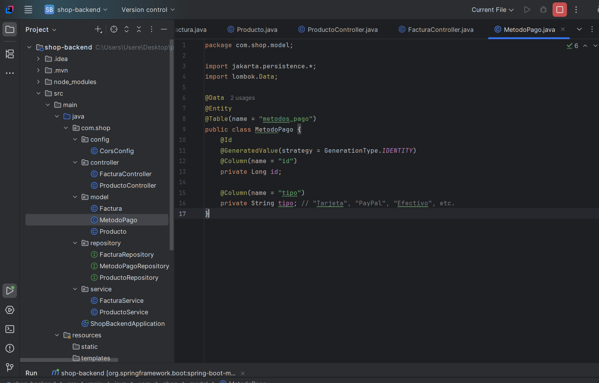
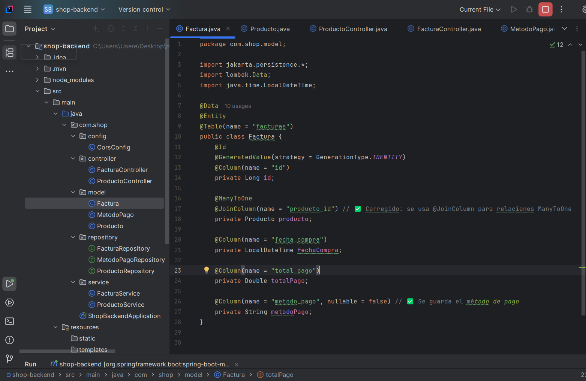
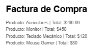

# 📌 HU5: Registro y Gestión de Compras en el Backend

## 📝 **Título:** Módulo de Compras y Facturación

### **Descripción**
Como **administrador del sistema**, quiero **gestionar la compra de productos**, incluyendo la selección del método de pago, para que los datos de la venta queden correctamente registrados en la base de datos.

### ✅ **Criterios de Aceptación**
-  El sistema debe permitir la creación de facturas vinculadas a un producto y a un método de pago.
-  Cada factura debe incluir la fecha de compra, el total pagado y el método de pago seleccionado.
-  El backend debe permitir la consulta de todas las compras realizadas, filtradas por fecha o método de pago.
-  Los métodos de pago deben estar predefinidos, asegurando que no haya errores al registrar una compra.
-  El sistema debe permitir futuras extensiones, como la integración con pasarelas de pago externas.

---

## 🏗️ **Flujo de Trabajo**
### **1️⃣ Creación de Productos**
El administrador agrega un producto con nombre, descripción y precio.  
El backend almacena los productos en la base de datos para que puedan ser comprados.

---

### **2️⃣ Selección de Método de Pago**
El usuario selecciona un método de pago antes de comprar un producto.  
Los métodos de pago disponibles son **"Tarjeta", "PayPal" y "Efectivo"**.  
El backend valida el método de pago antes de registrar la compra.

---

### **3️⃣ Creación de Factura**
El usuario finaliza la compra y se genera una factura.  
La factura almacena el producto comprado, el total pagado y el método de pago.  
Los datos son guardados en la base de datos para futuras consultas.

---

### **4️⃣ Consulta de Facturas**
El administrador consulta todas las facturas generadas.  
Puede filtrar por fecha o método de pago para análisis de ventas.  
El backend devuelve los datos en formato JSON para visualización.

---

## 🔧 **Requisitos Técnicos**
- ✅ **Spring Boot** con controladores REST (`FacturaController.java`, `ProductoController.java`).
- ✅ **Base de datos MySQL** con tablas `facturas`, `productos` y `metodos_pago`.
- ✅ **API RESTful** para gestionar compras (`POST /facturas`, `GET /facturas`).
- ✅ **Validaciones en el backend** para asegurar que todos los datos se registren correctamente.

---

## 🚀 **Resultado Esperado**
- El sistema debe permitir la gestión de compras completas, incluyendo productos, métodos de pago y facturas.
- Las consultas de facturas deben ser rápidas y organizadas, facilitando el análisis de ventas.
- El backend debe estar preparado para futuras expansiones, como integración con pasarelas de pago externas.

